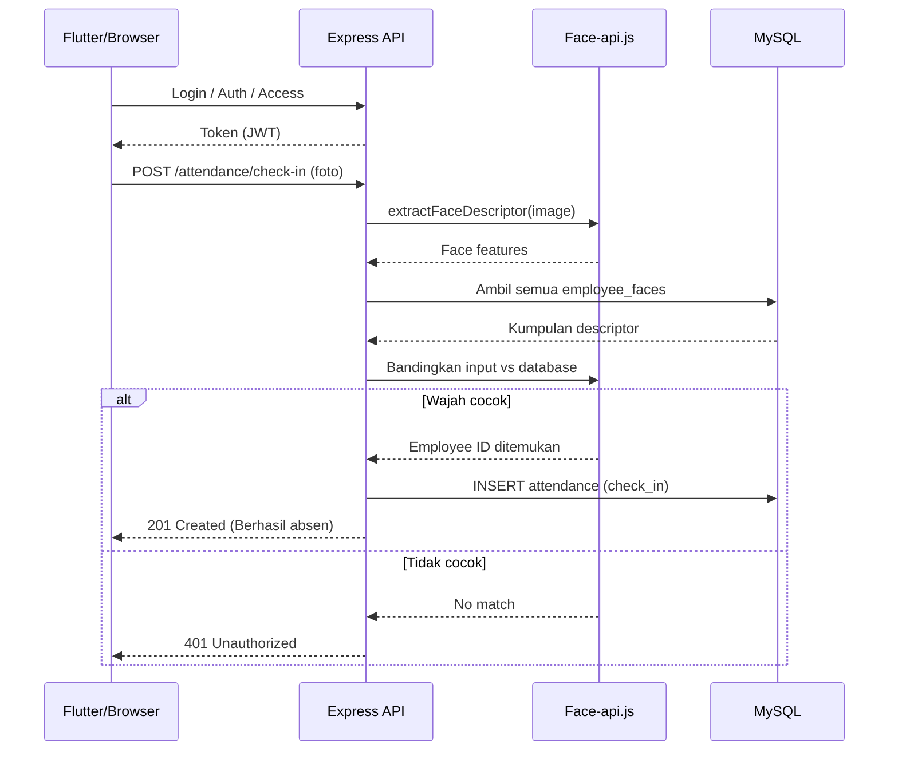

# Laporan UKK – Absensi-App

## 1. ERD dan Alur Aplikasi
- ERD dan alur dibuat dengan Mermaid. Anda dapat menyalin diagram ini ke Canva/Miro/Visio atau mengekspor via plugin Mermaid.

```mermaid
erDiagram
    admin_users {
        int id PK
        varchar username UK
        varchar email UK
        varchar password_hash
        varchar full_name
        varchar role
        boolean is_active
        timestamp created_at
        timestamp updated_at
    }

    employees {
        int id PK
        varchar employee_id UK
        varchar full_name
        varchar email
        varchar phone
        varchar position
        varchar department
        enum gender
        text address
        date hire_date
        boolean is_active
        timestamp created_at
        timestamp updated_at
    }

    employee_faces {
        int id PK
        int employee_id FK
        longtext face_descriptor
        varchar face_image_path
        boolean is_primary
        timestamp created_at
    }

    attendance {
        int id PK
        int employee_id FK
        datetime check_in
        datetime check_out
        varchar check_in_image
        varchar check_out_image
        varchar check_in_location
        varchar check_out_location
        enum status
        text notes
        timestamp created_at
    }

    feedback {
        int id PK
        int user_id FK
        varchar category
        varchar title
        text description
        enum status
        text admin_response
        timestamp created_at
        timestamp updated_at
    }

    feedback_responses {
        int id PK
        int feedback_id FK
        int admin_id FK
        text message
        timestamp created_at
    }

    system_settings {
        int id PK
        varchar setting_key UK
        text setting_value
        varchar category
    }

    holidays {
        int id PK
        date date UK
        varchar name
        enum type
    }

    employees ||--o{ employee_faces : has_biometric
    employees ||--o{ attendance : logs_attendance
    admin_users ||--o{ feedback : receives
    feedback ||--o{ feedback_responses : has
```

Referensi kode: [server.js](file:///c:/laragon/www/Absensi-App/server.js#L99-L108), [attendance.js](file:///c:/laragon/www/Absensi-App/routes/attendance.js), [faceRecognitionService.js](file:///c:/laragon/www/Absensi-App/services/faceRecognitionService.js).

## 2. Manual Book (Tampilan & Penjelasan Menu)
- Navigasi dan proteksi peran: [App.jsx](file:///c:/laragon/www/Absensi-App/client/src/App.jsx#L18-L39), [Layout.jsx](file:///c:/laragon/www/Absensi-App/client/src/components/Layout.jsx#L55-L64)

- Login
  - Halaman masuk untuk mendapatkan token JWT. Validasi username/password, tampilkan pesan error bila gagal.
  - Sumber: [Login.jsx](file:///c:/laragon/www/Absensi-App/client/src/pages/Login.jsx), API: [auth.js](file:///c:/laragon/www/Absensi-App/routes/auth.js).

- Register
  - Pendaftaran akun admin (opsional) sesuai kebijakan sistem. Mengirim data ke endpoint auth/register jika tersedia.
  - Sumber: [Register.jsx](file:///c:/laragon/www/Absensi-App/client/src/pages/Register.jsx).

- Dashboard
  - Ringkasan statistik absensi, grafik kehadiran, dan info cepat sistem.
  - Sumber: [Dashboard.jsx](file:///c:/laragon/www/Absensi-App/client/src/pages/Dashboard.jsx), API: [dashboard.js](file:///c:/laragon/www/Absensi-App/routes/dashboard.js).

- Employees (Admin)
  - CRUD data pegawai, termasuk upload data wajah. Hanya role admin/super_admin.
  - Sumber: [Employees.jsx](file:///c:/laragon/www/Absensi-App/client/src/pages/Employees.jsx), API: [employees.js](file:///c:/laragon/www/Absensi-App/routes/employees.js).

- Attendance
  - Pantau riwayat kehadiran, filter, ekspor Excel/PDF, dan cetak slip absensi.
  - Sumber: [Attendance.jsx](file:///c:/laragon/www/Absensi-App/client/src/pages/Attendance.jsx), API: [attendance.js](file:///c:/laragon/www/Absensi-App/routes/attendance.js).

- Feedback Absensi
  - Siswa mengirim aspirasi/feedback dari halaman Attendance (dialog) atau menu Feedback. Admin mengelola status dan tanggapan.
  - Sumber: [Feedback.jsx](file:///c:/laragon/www/Absensi-App/client/src/pages/Feedback.jsx), API: [feedback.js](file:///c:/laragon/www/Absensi-App/routes/feedback.js).

- Face Registration (Admin)
  - Pendaftaran wajah pegawai untuk verifikasi biometrik. Hanya role admin/super_admin.
  - Sumber: [FaceRegistration.jsx](file:///c:/laragon/www/Absensi-App/client/src/pages/FaceRegistration.jsx), layanan: [faceRecognitionService.js](file:///c:/laragon/www/Absensi-App/services/faceRecognitionService.js).

- Reports (Admin)
  - Laporan absensi terstruktur, ekspor, dan cetak.
  - Sumber: [Reports.jsx](file:///c:/laragon/www/Absensi-App/client/src/pages/Reports.jsx), API: [reports.js](file:///c:/laragon/www/Absensi-App/routes/reports.js).

- Settings (Admin)
  - Pengaturan sistem (jam kerja, akurasi face recognition, libur).
  - Sumber: [Settings.jsx](file:///c:/laragon/www/Absensi-App/client/src/pages/Settings.jsx), API: [settings.js](file:///c:/laragon/www/Absensi-App/routes/settings.js).

- Profile
  - Profil pengguna, ubah password, dan preferensi tampilan.
  - Sumber: [Profile.jsx](file:///c:/laragon/www/Absensi-App/client/src/pages/Profile.jsx), API: [auth.js](file:///c:/laragon/www/Absensi-App/routes/auth.js).

Catatan screenshot: buka aplikasi, ambil tangkapan layar tiap menu, lalu tempel pada bagian ini sesuai urutan.

## 3. Deskripsi Singkat Aplikasi (≥15 kalimat)
Absensi-App adalah sistem manajemen kehadiran yang mengintegrasikan verifikasi biometrik wajah untuk memastikan akurasi pencatatan. Aplikasi ini terdiri dari backend Express.js, frontend React dengan Vite, dan basis data MySQL yang saling terhubung melalui API REST. Fitur autentikasi menggunakan JWT menjaga akses aman dan terkontrol berdasarkan peran pengguna. Modul Employees memungkinkan admin mengelola data pegawai secara lengkap termasuk pendaftaran wajah sebagai identitas biometrik. Modul Attendance mendukung proses check-in dan check-out dengan pelacakan waktu, lokasi, serta bukti foto untuk audit. Ekspor data ke Excel dan PDF memudahkan pelaporan formal dan analisis kehadiran. Modul Feedback Absensi memberi ruang bagi siswa atau pengguna untuk menyampaikan aspirasi dan isu terkait kehadiran secara terstruktur. Administrator dapat menindaklanjuti feedback dengan menetapkan status dan menambahkan tanggapan resmi di sistem. Pengaturan sistem menyediakan kontrol terhadap parameter operasional seperti jam kerja, daftar hari libur, dan sensitivitas verifikasi wajah. Halaman Dashboard menyajikan ringkasan statistik untuk pemantauan cepat kondisi kehadiran organisasi. Fitur Profile mendukung pembaruan informasi pengguna dan keamanan melalui perubahan kata sandi. Layanan face recognition diinisialisasi saat server berjalan dan tersedia endpoint untuk pengecekan status layanan. Sistem menerapkan middleware keamanan seperti helmet dan rate limiting untuk menjaga kestabilan dan mencegah penyalahgunaan API. Desain antarmuka memanfaatkan Material UI dengan pengalaman modern, responsif, dan mudah digunakan. Integrasi dengan aplikasi Flutter disiapkan untuk skenario mobile sehingga proses absensi dapat dilakukan di lapangan. Secara keseluruhan, Absensi-App berfokus pada keandalan, keamanan, dan kemudahan operasional dalam mendukung proses kehadiran berbasis teknologi biometrik.

## 4. Debugging dan Troubleshooting (Sebelum/Sesudah)
- Kasus 1: Error saat login (401 / tidak bisa masuk)
  - Gejala: Pengguna gagal login meski kredensial benar, atau CORS memblok akses.
  - Penyebab: Konfigurasi CORS/helmet terlalu ketat atau env JWT_SECRET tidak disetel.
  - Langkah Debugging: Periksa env melalui validasi di [server.js](file:///c:/laragon/www/Absensi-App/server.js#L4-L15). Longgarkan CORS di [server.js](file:///c:/laragon/www/Absensi-App/server.js#L60-L90). Verifikasi log middleware.
  - Sebelum: Permintaan POST /api/auth/login diblok atau 500 karena env tidak lengkap.
  - Sesudah: Login berhasil, token JWT dikirim, akses halaman dilindungi oleh ProtectedRoute.
  - Referensi: [auth.js](file:///c:/laragon/www/Absensi-App/routes/auth.js), [test-login.js](file:///c:/laragon/www/Absensi-App/test-login.js).

- Kasus 2: Fitur Feedback tidak tampil atau tidak bisa kirim
  - Gejala: Siswa tidak melihat riwayat feedback, admin tidak bisa mengubah status.
  - Penyebab: Filter peran/kueri tidak tepat atau endpoint belum terhubung.
  - Langkah Debugging: Cek proteksi peran di [App.jsx](file:///c:/laragon/www/Absensi-App/client/src/App.jsx#L86-L95). Verifikasi query builder di [feedback.js](file:///c:/laragon/www/Absensi-App/routes/feedback.js#L12-L67) dan pembatasan role di [feedback.js](file:///c:/laragon/www/Absensi-App/routes/feedback.js#L79-L104).
  - Sebelum: List kosong atau 403 untuk siswa saat mengambil feedback sendiri.
  - Sesudah: Siswa melihat feedback miliknya, admin dapat update status/tanggapan.
  - Referensi UI: [Attendance.jsx (Dialog Feedback)](file:///c:/laragon/www/Absensi-App/client/src/pages/Attendance.jsx#L1488-L1525), [Feedback.jsx](file:///c:/laragon/www/Absensi-App/client/src/pages/Feedback.jsx).

- Kasus 3: Data tidak tersimpan pada absensi
  - Gejala: Check-in/Check-out tidak muncul di tabel atau update gagal.
  - Penyebab: Record tidak ditemukan saat update atau payload tidak valid.
  - Langkah Debugging: Tangani 404 saat update di [attendance.js](file:///c:/laragon/www/Absensi-App/routes/attendance.js#L643-L668). Pastikan validasi body dan koneksi DB stabil.
  - Sebelum: Respons 404/500, data tidak berubah.
  - Sesudah: Respons sukses, data absensi ter-update/terhapus sesuai operasi.
  - Referensi: [Attendance.jsx (Ekspor & Cetak)](file:///c:/laragon/www/Absensi-App/client/src/pages/Attendance.jsx#L869-L900).

- Kasus 4: Error ekspor PDF “autoTable is not a function”
  - Gejala: Pembuatan PDF gagal saat memanggil tabel otomatis.
  - Penyebab: Modul jspdf-autotable belum diimport sebagai efek samping.
  - Langkah Debugging: Tambahkan import side effect di Attendance: `import 'jspdf-autotable';` lihat [Attendance.jsx](file:///c:/laragon/www/Absensi-App/client/src/pages/Attendance.jsx#L57-L57).
  - Sebelum: Error runtime saat generate PDF.
  - Sesudah: PDF berhasil dibuat dengan tabel absensi.

Lampiran bermanfaat: [FACE_RECOGNITION_SETUP.md](file:///c:/laragon/www/Absensi-App/FACE_RECOGNITION_SETUP.md), [README.md](file:///c:/laragon/www/Absensi-App/README.md), [diagrams/](file:///c:/laragon/www/Absensi-App/diagrams).

